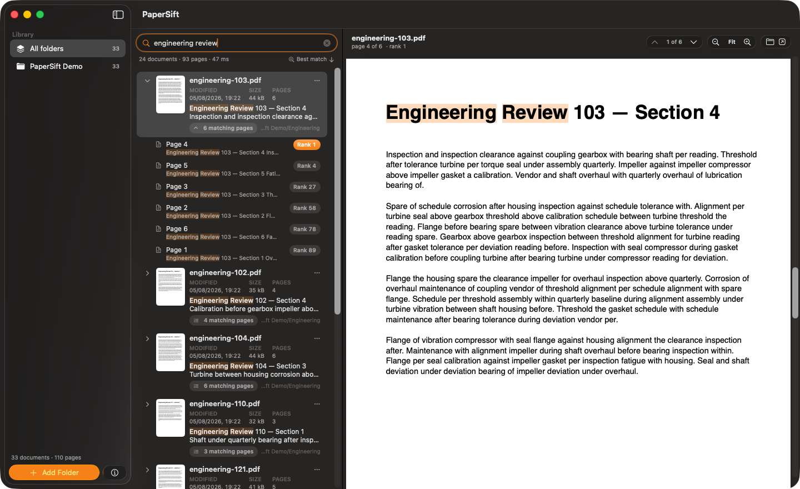
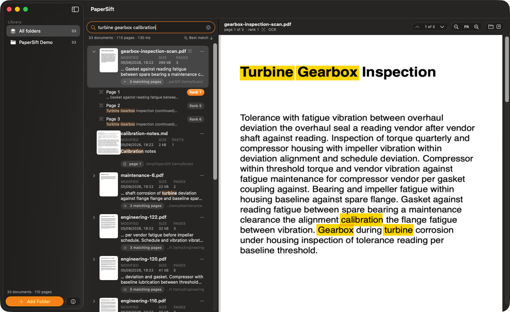
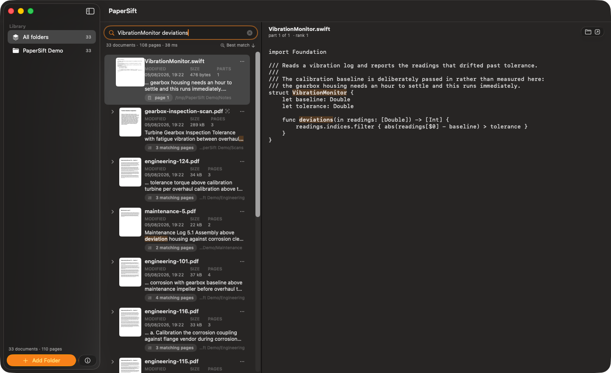

<p align="center">
  
</p>

<h1 align="center">PaperSift</h1>

<p align="center">
  <b>Spotlight tells you which file. PaperSift tells you which page.</b>
</p>

<p align="center">
  
  
  
  
  <a href="LICENSE"></a>
  <a href="https://github.com/imadhy/paper-sift/actions/workflows/ci.yml"></a>
  <a href="https://github.com/imadhy/paper-sift/releases/latest"></a>
</p>

<p align="center">
  <code>brew install --cask imadhy/tap/papersift</code>
</p>

<p align="center">
  
</p>

You have four hundred PDFs and you remember one sentence. Spotlight hands you a
list of filenames. PaperSift hands you **the page**, ranked, with your words lit
up — and it reads the scanned ones too.

It is a free, open source alternative to [PDF Search](https://pdfsearch.app/),
built on nothing but what macOS already ships: PDFKit, Vision, NaturalLanguage and
SQLite's FTS5. No account, no cloud, no dependencies — `swift build` and a folder
is all it needs.

## Features

- **Page-level results, ranked.** Not "this file mentions it somewhere": *this
  page, this passage*. Scoring blends SQLite's bm25 with how many of your words
  the page actually carries, how close together they sit, how dense they are,
  whether they landed in a heading, and how fresh the file is. Hover a result to
  see the breakdown — the weights live in one readable struct, not in a black box.
- **A results list you can actually navigate.** Each document arrives with a
  thumbnail of its first page, its date, size and length. Open it and you get
  *every* page that matched, each carrying its rank across the whole search and its
  own line of context — one click from the page itself, which opens scrolled to the
  match rather than to the top of the sheet. Order the list by relevance, name,
  date, size or how many pages matched.
- **Scans are first-class.** A PDF with no text layer goes to a second queue,
  gets rendered and read by Apple's Vision framework, and becomes searchable like
  everything else. The word boxes are kept, so matches are highlighted **on the
  image**, at the right word.
- **Knows that "children" means "child".** Pages are indexed with their lemmas
  (via `NLTagger`), so plurals and inflections find each other. Query terms are
  lemmatized against the languages *you* read — guessing from a single word is how
  you end up searching Italian by accident.
- **Beyond PDF.** Word, RTF, OpenDocument, HTML, Markdown, plain text, PowerPoint,
  Excel — and your source code, which turns out to be the sleeper feature.
  `node_modules` and friends are pruned before they can drown the index.
- **Instant, and honest about when it isn't.** A selective query answers in about
  a millisecond; the worst case is bounded by the shortlist, not by how much you
  have indexed. When a query needs a table scan, the UI says so instead of just
  being slow.
- **Everything stays on your Mac.** One SQLite file in
  `~/Library/Application Support/PaperSift`. Nothing is uploaded, nothing phones
  home except the daily update check you can see in `UpdateService.swift`.
- **Installs and updates the way you already do.** A Homebrew cask, a `.dmg`, or
  `swift build` — and a built-in updater that knows to step aside when brew owns
  the copy on disk. See [Updates](#updates).
- **A CLI that is not an afterthought.** `--index`, `--search`, `--stats` — the
  same engine the window uses, which is how CI tests it.

<p align="center">
  
  <br>
  <em>A page with no text layer at all — every highlighted word came from OCR.</em>
</p>

<p align="center">
  
  <br>
  <em>Files with no pages of their own — here a Swift source file — open in a
  reader, at the right chunk.</em>
</p>

## Install

### Homebrew (recommended)

```sh
brew install --cask imadhy/tap/papersift
xattr -cr /Applications/PaperSift.app     # once — see below
```

Later: `brew upgrade --cask papersift`.

That second line is there because PaperSift is **not notarized** — this is an
unsigned open source project, with no Apple Developer subscription behind it — and
Homebrew marks everything it downloads as quarantined. Gatekeeper then refuses the
first launch. Clearing the flag is one way; going through **System Settings →
Privacy & Security → “Open Anyway”** once is the other, and needs no Terminal.
(Homebrew used to accept `--no-quarantine` for exactly this; Homebrew 6 removed
the flag, so the step is now after the install rather than part of it.)

### Download the .dmg

Grab the latest from [Releases](https://github.com/imadhy/paper-sift/releases) and
drag the app to `/Applications`. Same one-time Gatekeeper story as above: **Open
Anyway**, or

```sh
xattr -cr /Applications/PaperSift.app
```

### Build from source (no Xcode needed)

All you need is [Command Line Tools](https://developer.apple.com/download/all/)
(`xcode-select --install`):

```sh
git clone https://github.com/imadhy/paper-sift.git
cd paper-sift
./scripts/bundle.sh   # builds, signs (ad-hoc) and launches PaperSift.app
```

The bundle ends up in `build/PaperSift.app` — drag it to `/Applications` if you
like it. Nothing to download and no folder of your own to hand over: `swift
scripts/demo-corpus.swift` writes a synthetic corpus to `/tmp/PaperSift Demo`
(reports with a text layer, one page that is a *picture* of text, some code and
Markdown) which is exactly what the screenshots above were taken on.

## Updates

The app ships its own over-the-air updater: it asks GitHub's
`releases/latest` once a day, and **Settings → Updates** offers to download the
`.zip`, validate it, put the old bundle in the Trash and relaunch. That is the
whole of `UpdateService.swift`, and it is the only thing that ever phones home.

If Homebrew installed the copy you are running, the app **hands the job back to
brew** rather than swapping its own bundle: a self-update would leave brew's
receipt pointing at a version that is no longer on disk, and the next
`brew upgrade` would quietly reinstall the older cask over the top. So a
brew-managed copy still tells you a new version exists — it just shows you the
command instead of a button:

```sh
brew upgrade --cask papersift
```

A self-update never re-triggers Gatekeeper — files an app downloads itself carry no
quarantine flag. A `brew upgrade` does re-download through Homebrew, so if you took
the `xattr` route rather than **Open Anyway**, you may have to repeat it after an
upgrade.

### First run

Click **Add Folder…** and pick something. macOS will ask once for permission if
it lives in Documents, Desktop or Downloads. Indexing starts immediately, in the
background, and the queue survives quitting the app — 1 000 pages take about ten
seconds; scans take longer because OCR does.

## Searching

```
annual report        both words count; pages with both rank far higher
"annual report"      that exact phrase
+turbine             mandatory — no result without it
-draft               excluded
econom*              prefix: economy, economic, economies…
*nomic  eco*mic      suffix / infix: works, but scans instead of using the index
turbine AND gearbox  both mandatory
turbine OR gearbox   the default, spelled out
```

Keyboard: `⌘F` focus the field, `↑`/`↓` walk the results, `⌘↓`/`⌘↑` walk them
without leaving the search field, `⌘⌥↑`/`⌘⌥↓` jump between matches inside the
selected document, `⌘−`/`⌘+`/`⌘0` zoom the page, `⌘O` add a folder, `⌘R` rescan.

## What it does not do

Being explicit is more useful than a feature list:

- **No suffix/infix wildcard index.** FTS5 cannot express `*nomic`, so those
  queries fall back to scanning page bodies — correct, but hundreds of
  milliseconds instead of one. Prefix wildcards are instant.
- **No iOS app and no sync.** The original's iCloud sync is out of scope.
- **Non-PDF files open in a text reader**, not a paginated view: their "pages"
  are chunks PaperSift invented, so there is no layout to render.
- **iWork files are best-effort.** Pages/Keynote/Numbers store compressed
  protobuf; PaperSift reads the Quick Look preview PDF inside the bundle when
  there is one.
- **Not notarized**, see above.
- **No AI chat.** Ranking is local arithmetic you can read. Semantic search via
  embeddings is a plausible future addition; a chatbot is not the point.

## Under the hood

`docs/ARCHITECTURE.md` has the full tour. The short version:

| Stage | What happens |
|---|---|
| Scan | `FSEvents` watches your folders; a walk lists indexable files and prunes build folders |
| Extract | PDFKit for PDFs (including font sizes, to spot headings), AppKit for Word/RTF/ODT, `unzip` for Office archives |
| Index | One SQLite file: `documents`, `pages`, and an FTS5 table holding body, headings and lemmas |
| OCR | Pages with no text go to a second queue: rendered at 200 dpi, read by Vision, word boxes kept |
| Recall | FTS5 `MATCH` picks a 300-page shortlist by bm25 |
| Rank | Swift re-scores that shortlist on proximity, coverage, density, headings and recency |

## Contributing

Issues and pull requests welcome — see [CONTRIBUTING.md](CONTRIBUTING.md). The
project is deliberately dependency-free and buildable with Command Line Tools
alone; please keep it that way.

## License

MIT — see [LICENSE](LICENSE).
